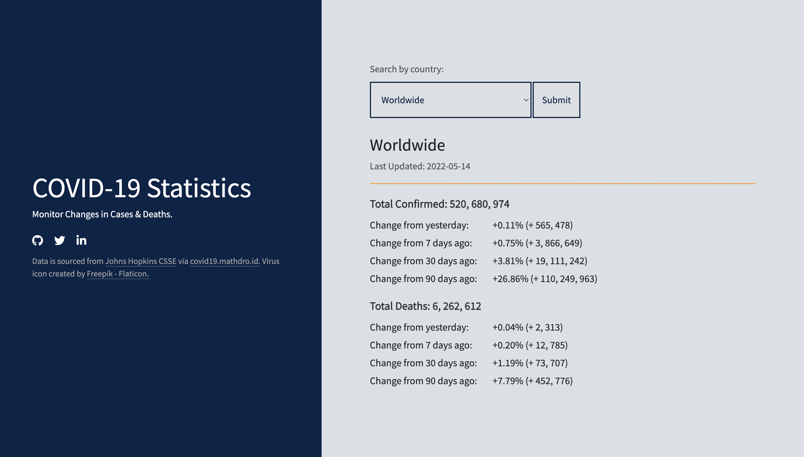

# Covid-19 Statistics

[Covid Statistics](https://imarijoyborda.com/covid19-statistics/) is a monitoring app that shows the percent and number of change in cases and deaths. Data are shown per country and in worldwide scale.  

My motivation: I'm currently involve in a local research group tackling COVID-19. With the large amount of data we have, it is easy to get drown on it. I made this web application to easily monitor the cases and deaths related to COVID-19 at a glance. With this, we can easily see whether the cases or deaths are rising significantly in the past days or not. This is intended to provide a quick feel of the COVID-19 situation at a country level.  

Link to project: [https://imarijoyborda.com/covid19-statistics/](https://imarijoyborda.com/covid19-statistics/. 

## How To Use
Simply visit the site to see the current cases and deaths statistics. You can also select the country of your interest. By default, the worldwide data is displayed. 

## How It's Made
This uses [COVID-19 API by mathdroid](https://github.com/mathdroid/covid-19-api) which sources data from [Johns Hopkins CSSE](https://github.com/CSSEGISandData/COVID-19). Tech used: HTML, CSS, Bootstrap, and JavaScript.

## Future Improvements
There are still lots that need to be improved in this web application. Some plans are:
* Add links for social media sharing (twitter, facebook, etc.)
* Display more statistics.

Contributions are also very welcome! Just issue a pull request.

## Thanks for checking it out!
